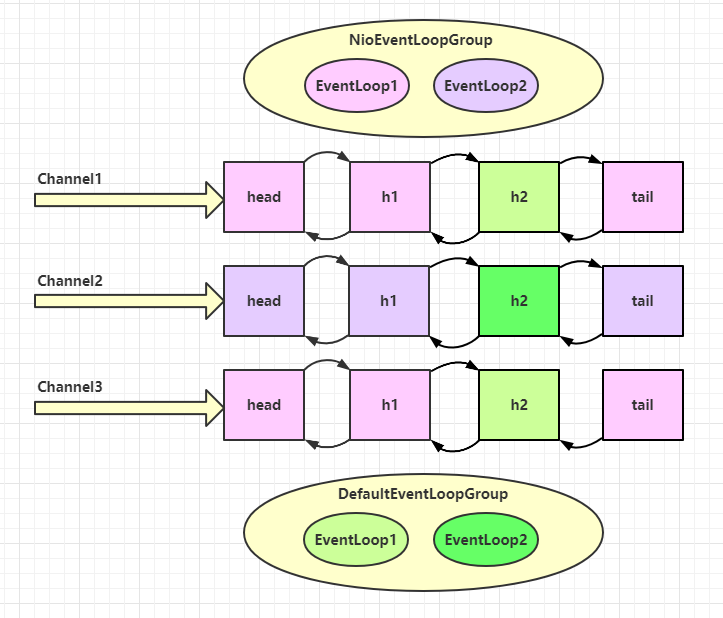
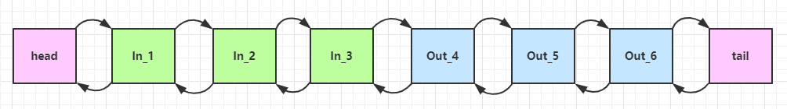

# 一.介绍

Netty是业界最流行的NIO框架之一，它的健壮性、功能、性能、可定制性和可扩展性在同类框架中都是首屈一指的，它已经得到成百上千的商用项目验证，例如Hadoop的RPC框架Avro就使用了Netty作为底层通信框架，其他还有业界主流的RPC框架，也使用Netty来构建高性能的异步通信能力。

- API使用简单，开发门槛低；
- 功能强大，预置了多种编解码功能，支持多种主流协议；
- 定制能力强，可以通过ChannelHandler对通信框架进行灵活地扩展；
- 性能高，通过与其他业界主流的NIO框架对比，Netty的综合性能最优；
- 成熟、稳定，Netty修复了已经发现的所有JDK NIO BUG，业务开发人员不需要再为NIO的BUG而烦恼；
- 社区活跃，版本迭代周期短，发现的BUG可以被及时修复，同时，更多的新功能会加入；
- 经历了大规模的商业应用考验，质量得到验证。Netty 在互联网、大数据、网络。游戏、企业应用、电信软件等众多行业已经得到了成功商用，证明它已经完全能够满足不同行业的商业应用了。
- Spring 5.x - flux api 完全抛弃了 tomcat ，使用 netty 作为服务器端

Netty 的作者Trustin Lee还是另一个著名网络应用框架Mina的重要贡献者。

# 二.组件介绍

## 1.案例

**服务端**

```java
new ServerBootstrap()
    .group(new NioEventLoopGroup()) // 1
    .channel(NioServerSocketChannel.class) // 2
    .childHandler(new ChannelInitializer<NioSocketChannel>() { // 3
        protected void initChannel(NioSocketChannel ch) {
            ch.pipeline().addLast(new StringDecoder()); // 5
            ch.pipeline().addLast(new SimpleChannelInboundHandler<String>() { // 6
                @Override
                protected void channelRead0(ChannelHandlerContext ctx, String msg) {
                    System.out.println(msg);
                }
            });
        }
    })
    .bind(8080); // 4
```

1. NioEventLoopGroup，可以简单理解为 `线程池 + Selector`

2. 选择服务 Scoket 实现类，其中 NioServerSocketChannel 表示基于 NIO 的服务器端实现，其它实现还有

3. childHandler，是接下来添加的处理器都是给 SocketChannel 用的，而不是给ServerSocketChannel。

   ChannelInitializer 处理器（仅执行一次），它的作用是待客户端 SocketChannel 建立连接后，执行 initChannel 以便添加更多的处理器。

4. ServerSocketChannel 绑定的监听端口

5. SocketChannel 的处理器，解码 ByteBuf => String

6. SocketChannel 的业务处理器，使用上一个处理器的处理结果

**客户端**

```java
new Bootstrap()
    .group(new NioEventLoopGroup()) // 1
    .channel(NioSocketChannel.class) // 2
    .handler(new ChannelInitializer<Channel>() { // 3
        @Override
        protected void initChannel(Channel ch) {
            ch.pipeline().addLast(new StringEncoder()); // 8
        }
    })
    .connect("127.0.0.1", 8080) // 4
    .sync() // 5
    .channel() // 6
    .writeAndFlush(new Date() + ": hello world!"); // 7
```

1. 创建 NioEventLoopGroup，同 Server
2. 选择客户 Socket 实现类，NioSocketChannel 表示基于 NIO 的客户端实现，其它实现还有
3. 添加 SocketChannel 的处理器，ChannelInitializer 处理器（仅执行一次），它的作用是待客户端 SocketChannel 建立连接后，执行 initChannel 以便添加更多的处理器
4. 指定要连接的服务器和端口
5. Netty 中很多方法都是异步的，如 connect，这时需要使用 sync 方法等待 connect 建立连接完毕
6. 获取 channel 对象，它即为通道抽象，可以进行数据读写操作
7. 写入消息并清空缓冲区
8. 消息会经过通道 handler 处理，这里是将 String => ByteBuf 发出
9. 数据经过网络传输，到达服务器端，服务器端 5 和 6 处的 handler 先后被触发，走完一个流程

> 一开始需要树立正确的观念
>
> * 把 channel 理解为数据的通道
> * 把 msg 理解为流动的数据，最开始输入是 ByteBuf，但经过 pipeline 的加工，会变成其它类型对象，最后输出又变成 ByteBuf
> * 把 handler 理解为数据的处理工序
>   * 工序有多道，合在一起就是 pipeline，pipeline 负责发布事件（读、读取完成...）传播给每个 handler， handler 对自己感兴趣的事件进行处理（重写了相应事件处理方法）
>   * handler 分 Inbound 和 Outbound 两类
> * 把 eventLoop 理解为处理数据的工人
>   * 工人可以管理多个 channel 的 io 操作，并且一旦工人负责了某个 channel，就要负责到底（绑定）
>   * 工人既可以执行 io 操作，也可以进行任务处理，每位工人有任务队列，队列里可以堆放多个 channel 的待处理任务，任务分为普通任务、定时任务
>   * 工人按照 pipeline 顺序，依次按照 handler 的规划（代码）处理数据，可以为每道工序指定不同的工人

## 2.EventLoop

**2.1 事件循环对象**

EventLoop 本质是一个单线程执行器（同时维护了一个 Selector），里面有 run 方法处理 Channel 上源源不断的 io 事件。

它的继承关系比较复杂

* 一条线是继承自 j.u.c.ScheduledExecutorService 因此包含了线程池中所有的方法
* 另一条线是继承自 netty 自己的 OrderedEventExecutor，
  * 提供了 boolean inEventLoop(Thread thread) 方法判断一个线程是否属于此 EventLoop
  * 提供了 parent 方法来看看自己属于哪个 EventLoopGroup

**2.2 事件循环组**

EventLoopGroup 是一组 EventLoop，Channel 一般会调用 EventLoopGroup 的 register 方法来绑定其中一个EventLoop，后续这个 Channel 上的 io 事件都由此 EventLoop 来处理（保证了 io 事件处理时的线程安全）

继承自 netty 自己的 EventExecutorGroup

* 实现了 Iterable 接口提供遍历 EventLoop 的能力
* 另有 next 方法获取集合中下一个 EventLoop

**2.3 优雅关闭**

优雅关闭 `shutdownGracefully` 方法。该方法会首先切换 `EventLoopGroup` 到关闭状态从而拒绝新的任务的加入，然后在任务队列的任务都处理完成后，停止线程的运行。从而确保整体应用是在正常有序的状态下退出的

**2.4 NioEventLoop 处理 io 事件**

```java
DefaultEventLoopGroup normalWorkers = new DefaultEventLoopGroup(2);
new ServerBootstrap()
    .group(new NioEventLoopGroup(1), new NioEventLoopGroup(2))
    .channel(NioServerSocketChannel.class)
    .childHandler(new ChannelInitializer<NioSocketChannel>() {
        @Override
        protected void initChannel(NioSocketChannel ch)  {
            ch.pipeline().addLast(new LoggingHandler(LogLevel.DEBUG));
            ch.pipeline().addLast(normalWorkers,"myhandler",
              new ChannelInboundHandlerAdapter() {
                @Override
                public void channelRead(ChannelHandlerContext ctx, Object msg) {
                    ByteBuf byteBuf = msg instanceof ByteBuf ? ((ByteBuf) msg) : null;
                    if (byteBuf != null) {
                        byte[] buf = new byte[16];
                        ByteBuf len = byteBuf.readBytes(buf, 0, byteBuf.readableBytes());
                        log.debug(new String(buf));
                    }
                }
            });
        }
    }).bind(8080).sync();
```

一个nio boss负责ServerSocketChannel上的accept事；nio worker 工人负责socketChannel上的读写操作。

增加两个非 nio 工人。



**2.5 handler 执行中如何换人**

关键代码 `io.netty.channel.AbstractChannelHandlerContext#invokeChannelRead()`

```java
static void invokeChannelRead(final AbstractChannelHandlerContext next, Object msg) {
    final Object m = next.pipeline.touch(ObjectUtil.checkNotNull(msg, "msg"), next);
    // 下一个 handler 的事件循环是否与当前的事件循环是同一个线程
    EventExecutor executor = next.executor();
    
    // 是，直接调用
    if (executor.inEventLoop()) {
        next.invokeChannelRead(m);
    } 
    // 不是，将要执行的代码作为任务提交给下一个事件循环处理（换人）
    else {
        executor.execute(new Runnable() {
            @Override
            public void run() {
                next.invokeChannelRead(m);
            }
        });
    }
}
```

## 3.Channel

**3.1 ChannelFuture**

**3.2 CloseFuture**

## 4.Future & Promise

首先要说明 netty 中的 Future 与 jdk 中的 Future 同名，但是是两个接口，netty 的 Future **继承自 jdk 的 Future**，而 Promise 又对 netty Future 进行了扩展

- jdk Future 只能同步等待任务结束（或成功、或失败）才能得到结果
- netty Future 可以同步等待任务结束得到结果，也可以异步方式得到结果，但都是要等任务结束
- netty Promise 不仅有 netty Future 的功能，而且脱离了任务独立存在，只作为两个线程间传递结果的容器

| 功能/名称    | jdk Future                     | netty Future                                                 | Promise      |
| ------------ | ------------------------------ | ------------------------------------------------------------ | ------------ |
| cancel       | 取消任务                       | -                                                            | -            |
| isCanceled   | 任务是否取消                   | -                                                            | -            |
| isDone       | 任务是否完成，不能区分成功失败 | -                                                            | -            |
| get          | 获取任务结果，阻塞等待         | -                                                            | -            |
| getNow       | -                              | 获取任务结果，非阻塞，还未产生结果时返回 null                | -            |
| await        | -                              | 等待任务结束，如果任务失败，不会抛异常，而是通过 isSuccess 判断 | -            |
| sync         | -                              | 等待任务结束，如果任务失败，抛出异常                         | -            |
| isSuccess    | -                              | 判断任务是否成功                                             | -            |
| cause        | -                              | 获取失败信息，非阻塞，如果没有失败，返回null                 | -            |
| addLinstener | -                              | 添加回调，异步接收结果                                       | -            |
| setSuccess   | -                              | -                                                            | 设置成功结果 |
| setFailure   | -                              | -                                                            | 设置失败结果 |

## 5.Handler & Pipeline

ChannelHandler 用来处理 Channel 上的各种事件，分为入站、出站两种。所有 ChannelHandler 被连成一串，就是 Pipeline

- 入站处理器通常是 ChannelInboundHandlerAdapter 的子类，主要用来读取客户端数据，写回结果
- 出站处理器通常是 ChannelOutboundHandlerAdapter 的子类，主要对写回结果进行加工

打个比喻，每个 Channel 是一个产品的加工车间，Pipeline 是车间中的流水线，ChannelHandler 就是流水线上的各道工序，而后面要讲的 ByteBuf 是原材料，经过很多工序的加工：先经过一道道入站工序，再经过一道道出站工序最终变成产品

```java
new ServerBootstrap()
    .group(new NioEventLoopGroup())
    .channel(NioServerSocketChannel.class)
    .childHandler(new ChannelInitializer<NioSocketChannel>() {
        protected void initChannel(NioSocketChannel ch) {
            ch.pipeline().addLast(new ChannelInboundHandlerAdapter(){
                @Override
                public void channelRead(ChannelHandlerContext ctx, Object msg) {
                    System.out.println(1);
                    ctx.fireChannelRead(msg); // 1
                }
            });
            ch.pipeline().addLast(new ChannelInboundHandlerAdapter(){
                @Override
                public void channelRead(ChannelHandlerContext ctx, Object msg) {
                    System.out.println(2);
                    ctx.fireChannelRead(msg); // 2
                }
            });
            ch.pipeline().addLast(new ChannelInboundHandlerAdapter(){
                @Override
                public void channelRead(ChannelHandlerContext ctx, Object msg) {
                    System.out.println(3);
                    ctx.channel().write(msg); // 3
                }
            });
            ch.pipeline().addLast(new ChannelOutboundHandlerAdapter(){
                @Override
                public void write(ChannelHandlerContext ctx, Object msg, 
                                  ChannelPromise promise) {
                    System.out.println(4);
                    ctx.write(msg, promise); // 4
                }
            });
            ch.pipeline().addLast(new ChannelOutboundHandlerAdapter(){
                @Override
                public void write(ChannelHandlerContext ctx, Object msg, 
                                  ChannelPromise promise) {
                    System.out.println(5);
                    ctx.write(msg, promise); // 5
                }
            });
            ch.pipeline().addLast(new ChannelOutboundHandlerAdapter(){
                @Override
                public void write(ChannelHandlerContext ctx, Object msg, 
                                  ChannelPromise promise) {
                    System.out.println(6);
                    ctx.write(msg, promise); // 6
                }
            });
        }
    })
    .bind(8080);
```

结果：

```java
1
2
3
6
5
4
```

可以看到，ChannelInboundHandlerAdapter 是按照 addLast 的顺序执行的，而 ChannelOutboundHandlerAdapter 是按照 addLast 的逆序执行的。ChannelPipeline 的实现是一个 ChannelHandlerContext（包装了 ChannelHandler） 组成的双向链表



- 入站处理器中，ctx.fireChannelRead(msg) 是 **调用下一个入站处理器**
  * 如果注释掉 1 处代码，则仅会打印 1
  * 如果注释掉 2 处代码，则仅会打印 1 2
- 3 处的 ctx.channel().write(msg) 会 **从尾部开始触发**后续出站处理器的执行
  * 如果注释掉 3 处代码，则仅会打印 1 2 3
- 类似的，出站处理器中，ctx.write(msg, promise) 的调用也会 **触发上一个出站处理器**
  * 如果注释掉 6 处代码，则仅会打印 1 2 3 6
- ctx.channel().write(msg) vs ctx.write(msg)
  * 都是触发出站处理器的执行
  * ctx.channel().write(msg) 从尾部开始查找出站处理器
  * ctx.write(msg) 是从当前节点找上一个出站处理器
  * 3 处的 ctx.channel().write(msg) 如果改为 ctx.write(msg) 仅会打印 1 2 3，因为节点3 之前没有其它出站处理器了
  * 6 处的 ctx.write(msg, promise) 如果改为 ctx.channel().write(msg) 会打印 1 2 3 6 6 6... 因为 ctx.channel().write() 是从尾部开始查找，结果又是节点6 自己


## 6.ByteBuf

```
+-------------------+------------------+------------------+
| discardable bytes |  readable bytes  |  writable bytes  |
|                   |     (CONTENT)    |                  |
+-------------------+------------------+------------------+
|                   |                  |                  |
0      <=      readerIndex   <=   writerIndex    <=    capacity
```

是对字节数据的封装。

ByteBuf有读指针和写指针，不像nio中的ByteBuffer公用一个指针 然后还要进行读写模式切换。

Bytebuf如果容量不够了可以动态扩容，但最大容量不能超过int的最大值。

分为四块区域分为：

- 废弃部分：已读部分
- 可读部分：读指针到写指针部分，随着不断读取，读指针往后移动
- 可写部分：起始位置到容量或最大容量，随着不断写入，写指针往后移动

四个属性为：读指针，写指针，容量，最大容量

优势：

* 池化 - 可以重用池中 ByteBuf 实例，更节约内存，减少内存溢出的可能
* 读写指针分离，不需要像 ByteBuffer 一样切换读写模式
* 可以自动扩容
* 支持链式调用，使用更流畅
* 很多地方体现零拷贝，例如 slice、duplicate、CompositeByteBuf

**1 创建**

```java
// 创建了一个默认的 ByteBuf（池化基于直接内存的 ByteBuf），初始容量是 10
ByteBuf buffer = ByteBufAllocator.DEFAULT.buffer(10);
```

**2 直接内存 vs 堆内存**

创建池化基于堆的 ByteBuf

```java
ByteBuf buffer = ByteBufAllocator.DEFAULT.heapBuffer(10);
```

创建池化基于直接内存的 ByteBuf

```java
ByteBuf buffer = ByteBufAllocator.DEFAULT.directBuffer(10);
```

- 直接内存创建和销毁的代价昂贵，但读写性能高（少一次内存复制），适合配合池化功能一起用
- 直接内存对 GC 压力小，因为这部分内存不受 JVM 垃圾回收的管理，但也要注意及时主动释放

**3 池化 vs 非池化**

池化的最大意义在于可以重用 ByteBuf，优点有

- 没有池化，则每次都得创建新的 ByteBuf 实例，这个操作对直接内存代价昂贵，就算是堆内存，也会增加 GC 压力
- 有了池化，则可以重用池中 ByteBuf 实例，并且采用了与 jemalloc 类似的内存分配算法提升分配效率
- 高并发时，池化功能更节约内存，减少内存溢出的可能

池化功能是否开启，可以通过下面的系统环境变量来设置

```java
-Dio.netty.allocator.type={unpooled|pooled}
```

**4 组成**


**5 写入**

| 方法签名                                                     | 含义                   | 备注                                        |
| ------------------------------------------------------------ | ---------------------- | ------------------------------------------- |
| writeBoolean(boolean value)                                  | 写入 boolean 值        | 用一字节 01\|00 代表 true\|false            |
| writeByte(int value)                                         | 写入 byte 值           |                                             |
| writeShort(int value)                                        | 写入 short 值          |                                             |
| writeInt(int value)                                          | 写入 int 值            | Big Endian，即 0x250，写入后 00 00 02 50    |
| writeIntLE(int value)                                        | 写入 int 值            | Little Endian，即 0x250，写入后 50 02 00 00 |
| writeLong(long value)                                        | 写入 long 值           |                                             |
| writeChar(int value)                                         | 写入 char 值           |                                             |
| writeFloat(float value)                                      | 写入 float 值          |                                             |
| writeDouble(double value)                                    | 写入 double 值         |                                             |
| writeBytes(ByteBuf src)                                      | 写入 netty 的 ByteBuf  |                                             |
| writeBytes(byte[] src)                                       | 写入 byte[]            |                                             |
| writeBytes(ByteBuffer src)                                   | 写入 nio 的 ByteBuffer |                                             |
| int writeCharSequence(CharSequence sequence, Charset charset) | 写入字符串             |                                             |

> 注意
>
> * 这些方法的未指明返回值的，其返回值都是 ByteBuf，意味着可以链式调用
> * 网络传输，默认习惯是 Big Endian

**6 扩容**

扩容规则是

* 如何写入后数据大小未超过 512，则选择下一个 16 的整数倍，例如写入后大小为 12 ，则扩容后 capacity 是 16
* 如果写入后数据大小超过 512，则选择下一个 2^n，例如写入后大小为 513，则扩容后 capacity 是 2^10=1024（2^9=512 已经不够了）
* 扩容不能超过 max capacity 会报错

**7 读取**

读过的内容，就属于废弃部分了，再读只能读那些尚未读取的部分。

如果需要重复读取，可以在 read 前先做个标记 mark，这时要重复读取的话，重置到标记位置 reset

```java
//标记
buffer.markReaderIndex();

// 重置
buffer.resetReaderIndex();
```

**8 retain & release**

由于 Netty 中有堆外内存的 ByteBuf 实现，堆外内存最好是手动来释放，而不是等 GC 垃圾回收。

- UnpooledHeapByteBuf 使用的是 JVM 内存，只需等 GC 回收内存即可
- UnpooledDirectByteBuf 使用的就是直接内存了，需要特殊的方法来回收内存
- PooledByteBuf 和它的子类使用了池化机制，需要更复杂的规则来回收内存

Netty 这里采用了引用计数法来控制回收内存，每个 ByteBuf 都实现了 ReferenceCounted 接口

* 每个 ByteBuf 对象的初始计数为 1
* 调用 release 方法计数减 1，如果计数为 0，ByteBuf 内存被回收
* 调用 retain 方法计数加 1，表示调用者没用完之前，其它 handler 即使调用了 release 也不会造成回收
* 当计数为 0 时，底层内存会被回收，这时即使 ByteBuf 对象还在，其各个方法均无法正常使用

谁来负责 release 呢？

请思考，因为 pipeline 的存在，一般需要将 ByteBuf 传递给下一个 ChannelHandler，如果在 finally 中 release 了，就失去了传递性（当然，如果在这个 ChannelHandler 内这个 ByteBuf 已完成了它的使命，那么便无须再传递）

基本规则是，**谁是最后使用者，谁负责 release**，详细分析如下

* 起点，对于 NIO 实现来讲，在 io.netty.channel.nio.AbstractNioByteChannel.NioByteUnsafe#read 方法中首次创建 ByteBuf 放入 pipeline（line 163 pipeline.fireChannelRead(byteBuf)）
* 入站 ByteBuf 处理原则
  * 对原始 ByteBuf 不做处理，调用 ctx.fireChannelRead(msg) 向后传递，这时无须 release
  * 将原始 ByteBuf 转换为其它类型的 Java 对象，这时 ByteBuf 就没用了，必须 release
  * 如果不调用 ctx.fireChannelRead(msg) 向后传递，那么也必须 release
  * 注意各种异常，如果 ByteBuf 没有成功传递到下一个 ChannelHandler，必须 release
  * 假设消息一直向后传，那么 TailContext 会负责释放未处理消息（原始的 ByteBuf）
* 出站 ByteBuf 处理原则
  * 出站消息最终都会转为 ByteBuf 输出，一直向前传，由 HeadContext flush 后 release
* 异常处理原则
  * 有时候不清楚 ByteBuf 被引用了多少次，但又必须彻底释放，可以循环调用 release 直到返回 true

**9 slice切片**

【零拷贝】的体现之一，对原始 ByteBuf 进行切片成多个 ByteBuf，切片后的 ByteBuf 并没有发生**内存复制**，还是使用原始 ByteBuf 的内存，切片后的 ByteBuf 维护独立的 read，write 指针


byteBuf.slice()无参切片方法，是从原始 ByteBuf 的 read index 到 write index 之间的内容进行切片，切片后的 max capacity 被固定为这个区间的大小，因此不能追加 write，否则会抛异常

**10 duplicate**

【零拷贝】的体现之一，就好比截取了原始 ByteBuf 所有内容，并且没有 max capacity 的限制，也是与原始 ByteBuf 使用同一块底层内存，只是读写指针是独立的


**11 copy**

会将底层内存数据进行深拷贝，因此无论读写，都与原始 ByteBuf 无关

**12 CompositeByteBuf**

【零拷贝】的体现之一，可以将多个 ByteBuf 合并为一个逻辑上的 ByteBuf，避免拷贝

CompositeByteBuf 是一个组合的 ByteBuf，它内部维护了一个 Component 数组，每个 Component 管理一个 ByteBuf，记录了这个 ByteBuf 相对于整体偏移量等信息，代表着整体中某一段的数据。

* 优点，对外是一个虚拟视图，组合这些 ByteBuf 不会产生内存复制
* 缺点，复杂了很多，多次操作会带来性能的损耗

**12 Unpooled**

Unpooled 是一个工具类，类如其名，提供了非池化的 ByteBuf 创建、组合、复制等操作

**13.其他方法**

`int capacity()`: 返回该缓冲区可以包含的字节数。

`ByteBuf capacity(int newCapacity)`: 调整此缓冲区的容量。

- 如果`newCapacity`小于当前容量，则该缓冲区的内容将被截断。

- 如果`newCapacity`大于当前容量，则在缓冲区中追加`(newCapacity - currentCapacity)`长度的未指定数据。

`int maxCapacity()`: 返回此缓冲区的最大允许容量。该值提供了`capacity()`的上限。

`ByteBufAllocator alloc()`: 返回创建此缓冲区的`ByteBufAllocator`。

`ByteBuf unwrap()`: 如果该缓冲区是另一个缓冲区的包装器，则返回底层缓冲区实例。

`boolean isDirect()`: 当且仅当该缓冲区由`NIO`直接缓冲区支持时返回true。

`boolean isReadOnly()`: 当且仅当此缓冲区是只读缓冲区时返回true。

`ByteBuf asReadOnly()`: 返回此缓冲区的只读版本。

`int readerIndex()`: 返回此缓存区的读索引值。

`ByteBuf readerIndex(int readerIndex)`:  重新设置该缓冲区的读索引`readerIndex` 值。

`int writerIndex()`: 返回此缓存区的写索引值。

`ByteBuf writerIndex(int writerIndex)`:  重新设置该缓冲区的写索引`writerIndex` 值。

`ByteBuf setIndex(int readerIndex, int writerIndex)`: 同时设置该缓冲区的读索引和写索引的值。

`int readableBytes()`:  返回该缓存区的可读字节数, 即`(writerIndex -readerIndex)`。

`int writableBytes()`: 返回该缓存区的可写字节数, 即`(capacity - writerIndex)`。

`int maxWritableBytes()`: 返回该缓存区的最大可写字节数, 即`(maxCapacity - writerIndex)`。

`int maxFastWritableBytes()`: 返回可以确定写入的最大字节数，而不涉及内部重新分配或数据拷贝。

`boolean isReadable()`: 当且仅当 `writerIndex - readerIndex` 的值大于`0`。

`boolean isReadable(int size)`: 当且仅当该缓冲区包含等于或大于指定数量的元素时返回`true`，即 `writerIndex - readerIndex >= size`。

`boolean isWritable()`:  当且仅当`capacity() - writerIndex`大于`0`。

`boolean isWritable(int size)`: 当且仅当该缓冲区有足够的空间允许写入指定数量的元素时返回`true`，即 `capacity() - writerIndex >= size`。

`ByteBuf clear()`: 将该缓冲区的`readerIndex`和`writerIndex`设置为`0`，这个方法与`setIndex(0,0)`相同。

`ByteBuf discardReadBytes()`: 丢弃第`0`个索引和`readerIndex`之间的字节。它将`readerIndex`和`writerIndex`之间的字节移动到第`0`个索引和 `writerIndex - readerIndex` 之间。

`ByteBuf discardSomeReadBytes()`: 类似于`discardReadBytes()`，不同之处是此方法可能会根据其内部实现丢弃一些、全部或不丢弃读字节，从而以潜在的额外内存消耗为代价减少总体内存带宽消耗。

`ByteBuf ensureWritable(int minWritableBytes)`: 扩展缓存区的容量，以便写入更多数据，如果没有超过扩展缓存区的最大容量 `maxCapacity`，那么就会扩展成功。

`int ensureWritable(int minWritableBytes, boolean force)`: 扩展缓存区的容量。与上一个方法不同，它会返回状态代码，来表示扩容情况

- `0` 表示缓冲区有足够的可写字节，且其容量不变。
- `1` 表示缓冲区没有足够的字节，且其容量不变。
- `2` 表示缓冲区有足够的可写字节，且其容量已增加。
- `3` 表示缓冲区没有足够的字节，但其容量已增加到最大。

`ByteBuf markReaderIndex()`,`ByteBuf resetReaderIndex()`, `ByteBuf markWriterIndex()` 和 `ByteBuf resetWriterIndex()` 用来标记和重置索引。

## 7.解码器

LengthFieldBasedFrameDecoder

# 三.协议设计与解析

自定义协议要素：

* 魔数，用来在第一时间判定是否是无效数据包
* 版本号，可以支持协议的升级
* 序列化算法，消息正文到底采用哪种序列化反序列化方式，可以由此扩展，例如：json、protobuf、hessian、jdk
* 指令类型，是登录、注册、单聊、群聊... 跟业务相关
* 请求序号，为了双工通信，提供异步能力
* 正文长度
* 消息正文


# 四.参数调优

**CONNECT_TIMEOUT_MILLIS**

- 属于 SocketChannal 参数
- 用在客户端建立连接时，如果在指定毫秒内无法连接，会抛出 timeout 异常
- SO_TIMEOUT 主要用在阻塞 IO，阻塞 IO 中 accept，read 等都是无限等待的，如果不希望永远阻塞，使用它调整超时时间

**SO_BACKLOG**

- 属于 ServerSocketChannal 参数

- ```mermaid
  sequenceDiagram
  
  participant c as client
  participant s as server
  participant sq as syns queue
  participant aq as accept queue
  
  s ->> s : bind()
  s ->> s : listen()
  c ->> c : connect()
  c ->> s : 1. SYN
  Note left of c : SYN_SEND
  s ->> sq : put
  Note right of s : SYN_RCVD
  s ->> c : 2. SYN + ACK
  Note left of c : ESTABLISHED
  c ->> s : 3. ACK
  sq ->> aq : put
  Note right of s : ESTABLISHED
  aq -->> s : 
  s ->> s : accept()
  ```

  1. 第一次握手，client 发送 SYN 到 server，状态修改为 SYN_SEND，server 收到，状态改变为 SYN_REVD，并将该请求放入 sync queue 队列
  2. 第二次握手，server 回复 SYN + ACK 给 client，client 收到，状态改变为 ESTABLISHED，并发送 ACK 给 server
  3. 第三次握手，server 收到 ACK，状态改变为 ESTABLISHED，将该请求从 sync queue 放入 accept queue
  4. 其中：
     - 在 linux 2.2 之前，backlog 大小包括了两个队列的大小，在 2.2 之后，分别用下面两个参数来控制
     - sync queue - 半连接队列
       * 大小通过 /proc/sys/net/ipv4/tcp_max_syn_backlog 指定，在 `syncookies` 启用的情况下，逻辑上没有最大值限制，这个设置便被忽略
     - accept queue - 全连接队列
       * 其大小通过 /proc/sys/net/core/somaxconn 指定，在使用 listen 函数时，内核会根据传入的 backlog 参数与系统参数，取二者的较小值
       * 如果 accpet queue 队列满了，server 将发送一个拒绝连接的错误信息到 client

**ulimit -n**

- 属于操作系统参数

**TCP_NODELAY**

- 属于 SocketChannal 参数

**SO_SNDBUF & SO_RCVBUF**

- SO_SNDBUF 属于 SocketChannal 参数
- SO_RCVBUF 既可用于 SocketChannal 参数，也可以用于 ServerSocketChannal 参数（建议设置到 ServerSocketChannal 上）

**ALLOCATOR**

* 属于 SocketChannal 参数
* 用来分配 ByteBuf， ctx.alloc()

**RCVBUF_ALLOCATOR**

* 属于 SocketChannal 参数
* 控制 netty 接收缓冲区大小
* 负责入站数据的分配，决定入站缓冲区的大小（并可动态调整），统一采用 direct 直接内存，具体池化还是非池化由 allocator 决定

# 五.源码分析

## 1.启动剖析

我们就来看看 netty 中对下面的代码是怎样进行处理的

```java
//1 netty 中使用 NioEventLoopGroup （简称 nio boss 线程）来封装线程和 selector
Selector selector = Selector.open(); 

//2 创建 NioServerSocketChannel，同时会初始化它关联的 handler，以及为原生 ssc 存储 config
NioServerSocketChannel attachment = new NioServerSocketChannel();

//3 创建 NioServerSocketChannel 时，创建了 java 原生的 ServerSocketChannel
ServerSocketChannel serverSocketChannel = ServerSocketChannel.open(); 
serverSocketChannel.configureBlocking(false);

//4 启动 nio boss 线程执行接下来的操作

//5 注册（仅关联 selector 和 NioServerSocketChannel），未关注事件
SelectionKey selectionKey = serverSocketChannel.register(selector, 0, attachment);

//6 head -> 初始化器 -> ServerBootstrapAcceptor -> tail，初始化器是一次性的，只为添加 acceptor

//7 绑定端口
serverSocketChannel.bind(new InetSocketAddress(8080));

//8 触发 channel active 事件，在 head 中关注 op_accept 事件
selectionKey.interestOps(SelectionKey.OP_ACCEPT);
```


入口 `io.netty.bootstrap.ServerBootstrap#bind`

关键代码 `io.netty.bootstrap.AbstractBootstrap#doBind`

```java
private ChannelFuture doBind(final SocketAddress localAddress) {
	// 1. 执行初始化和注册 regFuture 会由 initAndRegister 设置其是否完成，从而回调 3.2 处代码
    final ChannelFuture regFuture = initAndRegister();
    final Channel channel = regFuture.channel();
    if (regFuture.cause() != null) {
        return regFuture;
    }

    // 2. 因为是 initAndRegister 异步执行，需要分两种情况来看，调试时也需要通过 suspend 断点类型加以区分
    // 2.1 如果已经完成
    if (regFuture.isDone()) {
        ChannelPromise promise = channel.newPromise();
        // 3.1 立刻调用 doBind0
        doBind0(regFuture, channel, localAddress, promise);
        return promise;
    } 
    // 2.2 还没有完成
    else {
        final PendingRegistrationPromise promise = new PendingRegistrationPromise(channel);
        // 3.2 回调 doBind0
        regFuture.addListener(new ChannelFutureListener() {
            @Override
            public void operationComplete(ChannelFuture future) throws Exception {
                Throwable cause = future.cause();
                if (cause != null) {
                    // 处理异常...
                    promise.setFailure(cause);
                } else {
                    promise.registered();
					// 3. 由注册线程去执行 doBind0
                    doBind0(regFuture, channel, localAddress, promise);
                }
            }
        });
        return promise;
    }
}
```

关键代码 `io.netty.bootstrap.AbstractBootstrap#initAndRegister`

```java
final ChannelFuture initAndRegister() {
    Channel channel = null;
    try {
        channel = channelFactory.newChannel();
        // 1.1 初始化 - 做的事就是添加一个初始化器 ChannelInitializer
        init(channel);
    } catch (Throwable t) {
        // 处理异常...
        return new DefaultChannelPromise(new FailedChannel(), GlobalEventExecutor.INSTANCE).setFailure(t);
    }

    // 1.2 注册 - 做的事就是将原生 channel 注册到 selector 上
    ChannelFuture regFuture = config().group().register(channel);
    if (regFuture.cause() != null) {
        // 处理异常...
    }
    return regFuture;
}
```

关键代码 `io.netty.bootstrap.ServerBootstrap#init`

```java
// 这里 channel 实际上是 NioServerSocketChannel
void init(Channel channel) throws Exception {
    final Map<ChannelOption<?>, Object> options = options0();
    synchronized (options) {
        setChannelOptions(channel, options, logger);
    }

    final Map<AttributeKey<?>, Object> attrs = attrs0();
    synchronized (attrs) {
        for (Entry<AttributeKey<?>, Object> e: attrs.entrySet()) {
            @SuppressWarnings("unchecked")
            AttributeKey<Object> key = (AttributeKey<Object>) e.getKey();
            channel.attr(key).set(e.getValue());
        }
    }

    ChannelPipeline p = channel.pipeline();

    final EventLoopGroup currentChildGroup = childGroup;
    final ChannelHandler currentChildHandler = childHandler;
    final Entry<ChannelOption<?>, Object>[] currentChildOptions;
    final Entry<AttributeKey<?>, Object>[] currentChildAttrs;
    synchronized (childOptions) {
        currentChildOptions = childOptions.entrySet().toArray(newOptionArray(0));
    }
    synchronized (childAttrs) {
        currentChildAttrs = childAttrs.entrySet().toArray(newAttrArray(0));
    }
	
    // 为 NioServerSocketChannel 添加初始化器
    p.addLast(new ChannelInitializer<Channel>() {
        @Override
        public void initChannel(final Channel ch) throws Exception {
            final ChannelPipeline pipeline = ch.pipeline();
            ChannelHandler handler = config.handler();
            if (handler != null) {
                pipeline.addLast(handler);
            }

            // 初始化器的职责是将 ServerBootstrapAcceptor 加入至 NioServerSocketChannel
            ch.eventLoop().execute(new Runnable() {
                @Override
                public void run() {
                    pipeline.addLast(new ServerBootstrapAcceptor(
                            ch, currentChildGroup, currentChildHandler, currentChildOptions, currentChildAttrs));
                }
            });
        }
    });
}
```

关键代码 `io.netty.channel.AbstractChannel.AbstractUnsafe#register`

```java
public final void register(EventLoop eventLoop, final ChannelPromise promise) {
    // 一些检查，略...

    AbstractChannel.this.eventLoop = eventLoop;

    if (eventLoop.inEventLoop()) {
        register0(promise);
    } else {
        try {
            // 首次执行 execute 方法时，会启动 nio 线程，之后注册等操作在 nio 线程上执行
            // 因为只有一个 NioServerSocketChannel 因此，也只会有一个 boss nio 线程
            // 这行代码完成的事实是 main -> nio boss 线程的切换
            eventLoop.execute(new Runnable() {
                @Override
                public void run() {
                    register0(promise);
                }
            });
        } catch (Throwable t) {
            // 日志记录...
            closeForcibly();
            closeFuture.setClosed();
            safeSetFailure(promise, t);
        }
    }
}
```


`io.netty.channel.AbstractChannel.AbstractUnsafe#register0`

```java
private void register0(ChannelPromise promise) {
    try {
        if (!promise.setUncancellable() || !ensureOpen(promise)) {
            return;
        }
        boolean firstRegistration = neverRegistered;
        // 1.2.1 原生的 nio channel 绑定到 selector 上，注意此时没有注册 selector 关注事件，附件为 NioServerSocketChannel
        doRegister();
        neverRegistered = false;
        registered = true;

        // 1.2.2 执行 NioServerSocketChannel 初始化器的 initChannel
        pipeline.invokeHandlerAddedIfNeeded();

        // 回调 3.2 io.netty.bootstrap.AbstractBootstrap#doBind0
        safeSetSuccess(promise);
        pipeline.fireChannelRegistered();
        
        // 对应 server socket channel 还未绑定，isActive 为 false
        if (isActive()) {
            if (firstRegistration) {
                pipeline.fireChannelActive();
            } else if (config().isAutoRead()) {
                beginRead();
            }
        }
    } catch (Throwable t) {
        // Close the channel directly to avoid FD leak.
        closeForcibly();
        closeFuture.setClosed();
        safeSetFailure(promise, t);
    }
}
```

关键代码 `io.netty.channel.ChannelInitializer#initChannel`

```java
private boolean initChannel(ChannelHandlerContext ctx) throws Exception {
    if (initMap.add(ctx)) { // Guard against re-entrance.
        try {
            // 1.2.2.1 执行初始化
            initChannel((C) ctx.channel());
        } catch (Throwable cause) {
            exceptionCaught(ctx, cause);
        } finally {
            // 1.2.2.2 移除初始化器
            ChannelPipeline pipeline = ctx.pipeline();
            if (pipeline.context(this) != null) {
                pipeline.remove(this);
            }
        }
        return true;
    }
    return false;
}
```

关键代码 `io.netty.bootstrap.AbstractBootstrap#doBind0`

```java
// 3.1 或 3.2 执行 doBind0
private static void doBind0(
        final ChannelFuture regFuture, final Channel channel,
        final SocketAddress localAddress, final ChannelPromise promise) {

    channel.eventLoop().execute(new Runnable() {
        @Override
        public void run() {
            if (regFuture.isSuccess()) {
                channel.bind(localAddress, promise).addListener(ChannelFutureListener.CLOSE_ON_FAILURE);
            } else {
                promise.setFailure(regFuture.cause());
            }
        }
    });
}
```

关键代码 `io.netty.channel.AbstractChannel.AbstractUnsafe#bind`

```java
public final void bind(final SocketAddress localAddress, final ChannelPromise promise) {
    assertEventLoop();

    if (!promise.setUncancellable() || !ensureOpen(promise)) {
        return;
    }

    if (Boolean.TRUE.equals(config().getOption(ChannelOption.SO_BROADCAST)) &&
        localAddress instanceof InetSocketAddress &&
        !((InetSocketAddress) localAddress).getAddress().isAnyLocalAddress() &&
        !PlatformDependent.isWindows() && !PlatformDependent.maybeSuperUser()) {
        // 记录日志...
    }

    boolean wasActive = isActive();
    try {
        // 3.3 执行端口绑定
        doBind(localAddress);
    } catch (Throwable t) {
        safeSetFailure(promise, t);
        closeIfClosed();
        return;
    }

    if (!wasActive && isActive()) {
        invokeLater(new Runnable() {
            @Override
            public void run() {
                // 3.4 触发 active 事件
                pipeline.fireChannelActive();
            }
        });
    }

    safeSetSuccess(promise);
}
```

3.3 关键代码 `io.netty.channel.socket.nio.NioServerSocketChannel#doBind`

```java
protected void doBind(SocketAddress localAddress) throws Exception {
    if (PlatformDependent.javaVersion() >= 7) {
        javaChannel().bind(localAddress, config.getBacklog());
    } else {
        javaChannel().socket().bind(localAddress, config.getBacklog());
    }
}
```

3.4 关键代码 `io.netty.channel.DefaultChannelPipeline.HeadContext#channelActive`

```java
public void channelActive(ChannelHandlerContext ctx) {
    ctx.fireChannelActive();
	// 触发 read (NioServerSocketChannel 上的 read 不是读取数据，只是为了触发 channel 的事件注册)
    readIfIsAutoRead();
}
```

关键代码 `io.netty.channel.nio.AbstractNioChannel#doBeginRead`

```java
protected void doBeginRead() throws Exception {
    // Channel.read() or ChannelHandlerContext.read() was called
    final SelectionKey selectionKey = this.selectionKey;
    if (!selectionKey.isValid()) {
        return;
    }

    readPending = true;

    final int interestOps = selectionKey.interestOps();
    // readInterestOp 取值是 16，在 NioServerSocketChannel 创建时初始化好，代表关注 accept 事件
    if ((interestOps & readInterestOp) == 0) {
        selectionKey.interestOps(interestOps | readInterestOp);
    }
}
```

## 2.NioEventLoop 剖析

NioEventLoop 线程不仅要处理 IO 事件，还要处理 Task（包括普通任务和定时任务），

提交任务代码 `io.netty.util.concurrent.SingleThreadEventExecutor#execute`

```java
public void execute(Runnable task) {
    if (task == null) {
        throw new NullPointerException("task");
    }

    boolean inEventLoop = inEventLoop();
    // 添加任务，其中队列使用了 jctools 提供的 mpsc 无锁队列
    addTask(task);
    if (!inEventLoop) {
        // inEventLoop 如果为 false 表示由其它线程来调用 execute，即首次调用，这时需要向 eventLoop 提交首个任务，启动死循环，会执行到下面的 doStartThread
        startThread();
        if (isShutdown()) {
            // 如果已经 shutdown，做拒绝逻辑，代码略...
        }
    }

    if (!addTaskWakesUp && wakesUpForTask(task)) {
        // 如果线程由于 IO select 阻塞了，添加的任务的线程需要负责唤醒 NioEventLoop 线程
        wakeup(inEventLoop);
    }
}
```


唤醒 select 阻塞线程`io.netty.channel.nio.NioEventLoop#wakeup`

```java
@Override
protected void wakeup(boolean inEventLoop) {
    if (!inEventLoop && wakenUp.compareAndSet(false, true)) {
        selector.wakeup();
    }
}
```


启动 EventLoop 主循环 `io.netty.util.concurrent.SingleThreadEventExecutor#doStartThread`

```java
private void doStartThread() {
    assert thread == null;
    executor.execute(new Runnable() {
        @Override
        public void run() {
            // 将线程池的当前线程保存在成员变量中，以便后续使用
            thread = Thread.currentThread();
            if (interrupted) {
                thread.interrupt();
            }

            boolean success = false;
            updateLastExecutionTime();
            try {
                // 调用外部类 SingleThreadEventExecutor 的 run 方法，进入死循环，run 方法见下
                SingleThreadEventExecutor.this.run();
                success = true;
            } catch (Throwable t) {
                logger.warn("Unexpected exception from an event executor: ", t);
            } finally {
				// 清理工作，代码略...
            }
        }
    });
}
```


`io.netty.channel.nio.NioEventLoop#run` 主要任务是执行死循环，不断看有没有新任务，有没有 IO 事件

```java
protected void run() {
    for (;;) {
        try {
            try {
                // calculateStrategy 的逻辑如下：
                // 有任务，会执行一次 selectNow，清除上一次的 wakeup 结果，无论有没有 IO 事件，都会跳过 switch
                // 没有任务，会匹配 SelectStrategy.SELECT，看是否应当阻塞
                switch (selectStrategy.calculateStrategy(selectNowSupplier, hasTasks())) {
                    case SelectStrategy.CONTINUE:
                        continue;

                    case SelectStrategy.BUSY_WAIT:

                    case SelectStrategy.SELECT:
                        // 因为 IO 线程和提交任务线程都有可能执行 wakeup，而 wakeup 属于比较昂贵的操作，因此使用了一个原子布尔对象 wakenUp，它取值为 true 时，表示该由当前线程唤醒
                        // 进行 select 阻塞，并设置唤醒状态为 false
                        boolean oldWakenUp = wakenUp.getAndSet(false);
                        
                        // 如果在这个位置，非 EventLoop 线程抢先将 wakenUp 置为 true，并 wakeup
                        // 下面的 select 方法不会阻塞
                        // 等 runAllTasks 处理完成后，到再循环进来这个阶段新增的任务会不会及时执行呢?
                        // 因为 oldWakenUp 为 true，因此下面的 select 方法就会阻塞，直到超时
                        // 才能执行，让 select 方法无谓阻塞
                        select(oldWakenUp);

                        if (wakenUp.get()) {
                            selector.wakeup();
                        }
                    default:
                }
            } catch (IOException e) {
                rebuildSelector0();
                handleLoopException(e);
                continue;
            }

            cancelledKeys = 0;
            needsToSelectAgain = false;
            // ioRatio 默认是 50
            final int ioRatio = this.ioRatio;
            if (ioRatio == 100) {
                try {
                    processSelectedKeys();
                } finally {
                    // ioRatio 为 100 时，总是运行完所有非 IO 任务
                    runAllTasks();
                }
            } else {                
                final long ioStartTime = System.nanoTime();
                try {
                    processSelectedKeys();
                } finally {
                    // 记录 io 事件处理耗时
                    final long ioTime = System.nanoTime() - ioStartTime;
                    // 运行非 IO 任务，一旦超时会退出 runAllTasks
                    runAllTasks(ioTime * (100 - ioRatio) / ioRatio);
                }
            }
        } catch (Throwable t) {
            handleLoopException(t);
        }
        try {
            if (isShuttingDown()) {
                closeAll();
                if (confirmShutdown()) {
                    return;
                }
            }
        } catch (Throwable t) {
            handleLoopException(t);
        }
    }
}
```

⚠️ 注意

> 这里有个费解的地方就是 wakeup，它既可以由提交任务的线程来调用（比较好理解），也可以由 EventLoop 线程来调用（比较费解），这里要知道 wakeup 方法的效果：
>
> * 由非 EventLoop 线程调用，会唤醒当前在执行 select 阻塞的 EventLoop 线程
> * 由 EventLoop 自己调用，会本次的 wakeup 会取消下一次的 select 操作

参考下图


`io.netty.channel.nio.NioEventLoop#select`

```java
private void select(boolean oldWakenUp) throws IOException {
    Selector selector = this.selector;
    try {
        int selectCnt = 0;
        long currentTimeNanos = System.nanoTime();
        // 计算等待时间
        // * 没有 scheduledTask，超时时间为 1s
        // * 有 scheduledTask，超时时间为 `下一个定时任务执行时间 - 当前时间`
        long selectDeadLineNanos = currentTimeNanos + delayNanos(currentTimeNanos);

        for (;;) {
            long timeoutMillis = (selectDeadLineNanos - currentTimeNanos + 500000L) / 1000000L;
            // 如果超时，退出循环
            if (timeoutMillis <= 0) {
                if (selectCnt == 0) {
                    selector.selectNow();
                    selectCnt = 1;
                }
                break;
            }

            // 如果期间又有 task 退出循环，如果没这个判断，那么任务就会等到下次 select 超时时才能被执行
            // wakenUp.compareAndSet(false, true) 是让非 NioEventLoop 不必再执行 wakeup
            if (hasTasks() && wakenUp.compareAndSet(false, true)) {
                selector.selectNow();
                selectCnt = 1;
                break;
            }

            // select 有限时阻塞
            // 注意 nio 有 bug，当 bug 出现时，select 方法即使没有时间发生，也不会阻塞住，导致不断空轮询，cpu 占用 100%
            int selectedKeys = selector.select(timeoutMillis);
            // 计数加 1
            selectCnt ++;

            // 醒来后，如果有 IO 事件、或是由非 EventLoop 线程唤醒，或者有任务，退出循环
            if (selectedKeys != 0 || oldWakenUp || wakenUp.get() || hasTasks() || hasScheduledTasks()) {
                break;
            }
            if (Thread.interrupted()) {
               	// 线程被打断，退出循环
                // 记录日志
                selectCnt = 1;
                break;
            }

            long time = System.nanoTime();
            if (time - TimeUnit.MILLISECONDS.toNanos(timeoutMillis) >= currentTimeNanos) {
                // 如果超时，计数重置为 1，下次循环就会 break
                selectCnt = 1;
            } 
            // 计数超过阈值，由 io.netty.selectorAutoRebuildThreshold 指定，默认 512
            // 这是为了解决 nio 空轮询 bug
            else if (SELECTOR_AUTO_REBUILD_THRESHOLD > 0 &&
                    selectCnt >= SELECTOR_AUTO_REBUILD_THRESHOLD) {
                // 重建 selector
                selector = selectRebuildSelector(selectCnt);
                selectCnt = 1;
                break;
            }

            currentTimeNanos = time;
        }

        if (selectCnt > MIN_PREMATURE_SELECTOR_RETURNS) {
            // 记录日志
        }
    } catch (CancelledKeyException e) {
        // 记录日志
    }
}
```


处理 keys `io.netty.channel.nio.NioEventLoop#processSelectedKeys`

```java
private void processSelectedKeys() {
    if (selectedKeys != null) {
        // 通过反射将 Selector 实现类中的就绪事件集合替换为 SelectedSelectionKeySet 
        // SelectedSelectionKeySet 底层为数组实现，可以提高遍历性能（原本为 HashSet）
        processSelectedKeysOptimized();
    } else {
        processSelectedKeysPlain(selector.selectedKeys());
    }
}
```


`io.netty.channel.nio.NioEventLoop#processSelectedKey`

```java
private void processSelectedKey(SelectionKey k, AbstractNioChannel ch) {
    final AbstractNioChannel.NioUnsafe unsafe = ch.unsafe();
    // 当 key 取消或关闭时会导致这个 key 无效
    if (!k.isValid()) {
        // 无效时处理...
        return;
    }

    try {
        int readyOps = k.readyOps();
        // 连接事件
        if ((readyOps & SelectionKey.OP_CONNECT) != 0) {
            int ops = k.interestOps();
            ops &= ~SelectionKey.OP_CONNECT;
            k.interestOps(ops);

            unsafe.finishConnect();
        }

        // 可写事件
        if ((readyOps & SelectionKey.OP_WRITE) != 0) {
            ch.unsafe().forceFlush();
        }

        // 可读或可接入事件
        if ((readyOps & (SelectionKey.OP_READ | SelectionKey.OP_ACCEPT)) != 0 || readyOps == 0) {
            // 如果是可接入 io.netty.channel.nio.AbstractNioMessageChannel.NioMessageUnsafe#read
            // 如果是可读 io.netty.channel.nio.AbstractNioByteChannel.NioByteUnsafe#read
            unsafe.read();
        }
    } catch (CancelledKeyException ignored) {
        unsafe.close(unsafe.voidPromise());
    }
}
```

## 3.accept 剖析

nio 中如下代码，在 netty 中的流程

```java
//1 阻塞直到事件发生
selector.select();

Iterator<SelectionKey> iter = selector.selectedKeys().iterator();
while (iter.hasNext()) {    
    //2 拿到一个事件
    SelectionKey key = iter.next();
    
    //3 如果是 accept 事件
    if (key.isAcceptable()) {
        
        //4 执行 accept
        SocketChannel channel = serverSocketChannel.accept();
        channel.configureBlocking(false);
        
        //5 关注 read 事件
        channel.register(selector, SelectionKey.OP_READ);
    }
    // ...
}
```


先来看可接入事件处理（accept）

`io.netty.channel.nio.AbstractNioMessageChannel.NioMessageUnsafe#read`

```java
public void read() {
    assert eventLoop().inEventLoop();
    final ChannelConfig config = config();
    final ChannelPipeline pipeline = pipeline();    
    final RecvByteBufAllocator.Handle allocHandle = unsafe().recvBufAllocHandle();
    allocHandle.reset(config);

    boolean closed = false;
    Throwable exception = null;
    try {
        try {
            do {
				// doReadMessages 中执行了 accept 并创建 NioSocketChannel 作为消息放入 readBuf
                // readBuf 是一个 ArrayList 用来缓存消息
                int localRead = doReadMessages(readBuf);
                if (localRead == 0) {
                    break;
                }
                if (localRead < 0) {
                    closed = true;
                    break;
                }
				// localRead 为 1，就一条消息，即接收一个客户端连接
                allocHandle.incMessagesRead(localRead);
            } while (allocHandle.continueReading());
        } catch (Throwable t) {
            exception = t;
        }

        int size = readBuf.size();
        for (int i = 0; i < size; i ++) {
            readPending = false;
            // 触发 read 事件，让 pipeline 上的 handler 处理，这时是处理
            // io.netty.bootstrap.ServerBootstrap.ServerBootstrapAcceptor#channelRead
            pipeline.fireChannelRead(readBuf.get(i));
        }
        readBuf.clear();
        allocHandle.readComplete();
        pipeline.fireChannelReadComplete();

        if (exception != null) {
            closed = closeOnReadError(exception);

            pipeline.fireExceptionCaught(exception);
        }

        if (closed) {
            inputShutdown = true;
            if (isOpen()) {
                close(voidPromise());
            }
        }
    } finally {
        if (!readPending && !config.isAutoRead()) {
            removeReadOp();
        }
    }
}
```


关键代码 `io.netty.bootstrap.ServerBootstrap.ServerBootstrapAcceptor#channelRead`

```java
public void channelRead(ChannelHandlerContext ctx, Object msg) {
    // 这时的 msg 是 NioSocketChannel
    final Channel child = (Channel) msg;

    // NioSocketChannel 添加  childHandler 即初始化器
    child.pipeline().addLast(childHandler);

    // 设置选项
    setChannelOptions(child, childOptions, logger);

    for (Entry<AttributeKey<?>, Object> e: childAttrs) {
        child.attr((AttributeKey<Object>) e.getKey()).set(e.getValue());
    }

    try {
        // 注册 NioSocketChannel 到 nio worker 线程，接下来的处理也移交至 nio worker 线程
        childGroup.register(child).addListener(new ChannelFutureListener() {
            @Override
            public void operationComplete(ChannelFuture future) throws Exception {
                if (!future.isSuccess()) {
                    forceClose(child, future.cause());
                }
            }
        });
    } catch (Throwable t) {
        forceClose(child, t);
    }
}
```


又回到了熟悉的 `io.netty.channel.AbstractChannel.AbstractUnsafe#register`  方法

```java
public final void register(EventLoop eventLoop, final ChannelPromise promise) {
    // 一些检查，略...

    AbstractChannel.this.eventLoop = eventLoop;

    if (eventLoop.inEventLoop()) {
        register0(promise);
    } else {
        try {
            // 这行代码完成的事实是 nio boss -> nio worker 线程的切换
            eventLoop.execute(new Runnable() {
                @Override
                public void run() {
                    register0(promise);
                }
            });
        } catch (Throwable t) {
            // 日志记录...
            closeForcibly();
            closeFuture.setClosed();
            safeSetFailure(promise, t);
        }
    }
}
```

`io.netty.channel.AbstractChannel.AbstractUnsafe#register0`

```java
private void register0(ChannelPromise promise) {
    try {
        if (!promise.setUncancellable() || !ensureOpen(promise)) {
            return;
        }
        boolean firstRegistration = neverRegistered;
        doRegister();
        neverRegistered = false;
        registered = true;
		
        // 执行初始化器，执行前 pipeline 中只有 head -> 初始化器 -> tail
        pipeline.invokeHandlerAddedIfNeeded();
        // 执行后就是 head -> logging handler -> my handler -> tail

        safeSetSuccess(promise);
        pipeline.fireChannelRegistered();
        
        if (isActive()) {
            if (firstRegistration) {
                // 触发 pipeline 上 active 事件
                pipeline.fireChannelActive();
            } else if (config().isAutoRead()) {
                beginRead();
            }
        }
    } catch (Throwable t) {
        closeForcibly();
        closeFuture.setClosed();
        safeSetFailure(promise, t);
    }
}
```


回到了熟悉的代码 `io.netty.channel.DefaultChannelPipeline.HeadContext#channelActive`

```java
public void channelActive(ChannelHandlerContext ctx) {
    ctx.fireChannelActive();
	// 触发 read (NioSocketChannel 这里 read，只是为了触发 channel 的事件注册，还未涉及数据读取)
    readIfIsAutoRead();
}
```

`io.netty.channel.nio.AbstractNioChannel#doBeginRead`

```java
protected void doBeginRead() throws Exception {
    // Channel.read() or ChannelHandlerContext.read() was called
    final SelectionKey selectionKey = this.selectionKey;
    if (!selectionKey.isValid()) {
        return;
    }

    readPending = true;
	// 这时候 interestOps 是 0
    final int interestOps = selectionKey.interestOps();
    if ((interestOps & readInterestOp) == 0) {
        // 关注 read 事件
        selectionKey.interestOps(interestOps | readInterestOp);
    }
}
```

## 4.read 剖析

再来看可读事件 `io.netty.channel.nio.AbstractNioByteChannel.NioByteUnsafe#read`，注意发送的数据未必能够一次读完，因此会触发多次 nio read 事件，一次事件内会触发多次 pipeline read，一次事件会触发一次 pipeline read complete

```java
public final void read() {
    final ChannelConfig config = config();
    if (shouldBreakReadReady(config)) {
        clearReadPending();
        return;
    }
    final ChannelPipeline pipeline = pipeline();
    // io.netty.allocator.type 决定 allocator 的实现
    final ByteBufAllocator allocator = config.getAllocator();
    // 用来分配 byteBuf，确定单次读取大小
    final RecvByteBufAllocator.Handle allocHandle = recvBufAllocHandle();
    allocHandle.reset(config);

    ByteBuf byteBuf = null;
    boolean close = false;
    try {
        do {
            byteBuf = allocHandle.allocate(allocator);
            // 读取
            allocHandle.lastBytesRead(doReadBytes(byteBuf));
            if (allocHandle.lastBytesRead() <= 0) {
                byteBuf.release();
                byteBuf = null;
                close = allocHandle.lastBytesRead() < 0;
                if (close) {
                    readPending = false;
                }
                break;
            }

            allocHandle.incMessagesRead(1);
            readPending = false;
            // 触发 read 事件，让 pipeline 上的 handler 处理，这时是处理 NioSocketChannel 上的 handler
            pipeline.fireChannelRead(byteBuf);
            byteBuf = null;
        } 
        // 是否要继续循环
        while (allocHandle.continueReading());

        allocHandle.readComplete();
        // 触发 read complete 事件
        pipeline.fireChannelReadComplete();

        if (close) {
            closeOnRead(pipeline);
        }
    } catch (Throwable t) {
        handleReadException(pipeline, byteBuf, t, close, allocHandle);
    } finally {
        if (!readPending && !config.isAutoRead()) {
            removeReadOp();
        }
    }
}
```


`io.netty.channel.DefaultMaxMessagesRecvByteBufAllocator.MaxMessageHandle#continueReading(io.netty.util.UncheckedBooleanSupplier)`

```java
public boolean continueReading(UncheckedBooleanSupplier maybeMoreDataSupplier) {
    return 
           // 一般为 true
           config.isAutoRead() &&
           // respectMaybeMoreData 默认为 true
           // maybeMoreDataSupplier 的逻辑是如果预期读取字节与实际读取字节相等，返回 true
           (!respectMaybeMoreData || maybeMoreDataSupplier.get()) &&
           // 小于最大次数，maxMessagePerRead 默认 16
           totalMessages < maxMessagePerRead &&
           // 实际读到了数据
           totalBytesRead > 0;
}
```
