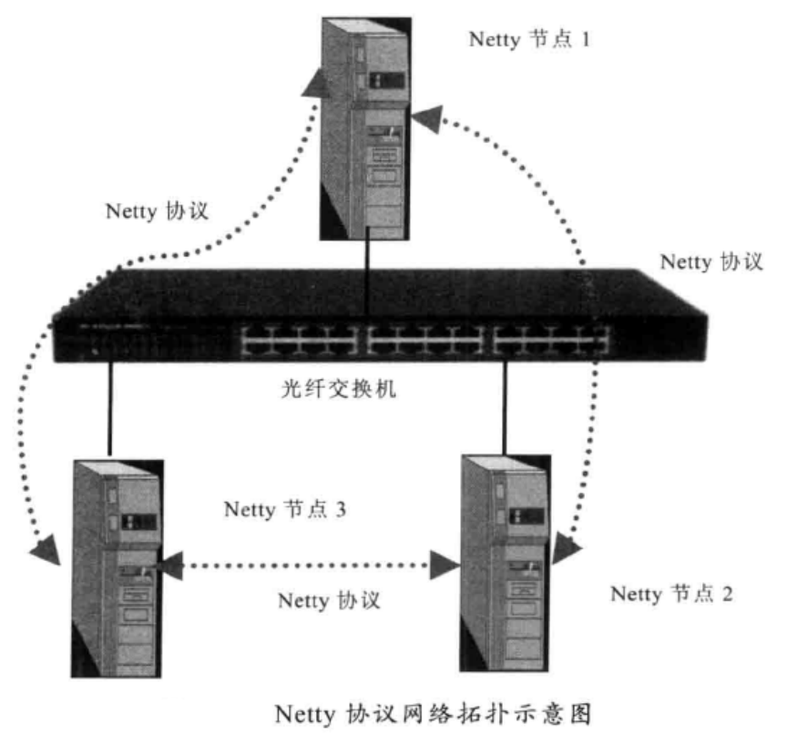
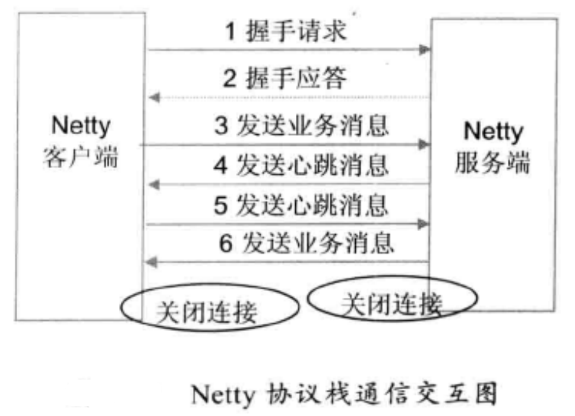

# 一.介绍

广义上区分，通信协议可以分为公有协议和私有协议。由于私有协议的灵活性，它往往会在某个公司或者组织内部使用，按需定制，也因为如此，升级起来会非常方便，灵活性好。

绝大多数的私有协议传输层都基于TCP/IP，所以利用Netty的NIO TCP协议栈可以
非常方便地进行私有协议的定制和开发。

私有协议本质上是厂商内部发展和采用的标准，除非授权，其他厂商一般无权使用该协议。私有协议也称非标准协议，就是未经国际或国家标准化组织采纳或批准，由某个企业自己制订，协议实现细节不愿公开，只在企业自己生产的设备之间使用的协议。私有协议具有封闭性、垄断性、排他性等特点。如果网上大量存在私有(非标准)协议，现行网络或用户一旦使用了它，后进入的厂家设备就必须跟着使用这种非标准协议，才能够互连互通，否则根本不可能进入现行网络。这样，使用非标准协议的厂“家就实现了垄断市场的愿望。

尽管私有协议具有垄断性的特征，但并非所有的私有协议设计者的初衷就是为了垒断。由于现代软件系统的复杂性，一个大型软件系统往往会被人为地拆分成多个模块，另外随着移动互联网的兴起，网站的规模也越来越大，业务的功能越来越多，为了能够支撑业务的发展，往往需要集群和分布式部署，这样，各个模块之间就要进行跨节点通信。

在传统的Java应用中，通常使用以下4种方式进行跨节点通信。

1. 通过RMI进行远程服务调用；
2. 通过Java的Socket+Java序列化的方式进行跨节点调用；
3. 利用- -些开源的RPC框架进行远程服务调用，例如Facebook 的Thrift、 Apache的Avro等；
4. 利用标准的公有协议进行跨节点服务调用，例如HTTP+XML、RESTful+JSON或
   者WebService。

跨节点的远程服务调用，除非链路层的物理连接外，还而安对请水和啊应用息进行编解码。在请求和应答消息本身以外，也需要携带一些其他控制和管理类指令，例如链路建立的握手请求和响应消息、链路检测的心跳消息等。当这些功能组合到一起之后， 就会形成私有协议。

事实上，私有协议并没有标准的定义，只要是能够用于跨进程、跨主机数据交换的非标准协议，都可以称为私有协议。通常情况下，正规的私有协议都有具体的协议规范文档，类似于《XXXX协议VXX规范》，但是在实际的项目中，内部使用的私有协议往往是口头约定的规范，由于并不需要对外呈现或者被外部调用，所以一般不会单独写相关的内部私有协议规范文档。

# 二.Netty协议栈功能设计

Netty协议栈用于内部各模块之间的通信，它基于TCP/IP协议栈，是一个类HTTP协
议的应用层协议栈，相比于传统的标准协议栈，它更加轻巧、灵活和实用。

## 1.网络拓扑图

在分布式组网环境下，每个Netty节点(Netty 进程)之间建立长连接，使用Netty协议进行通信。Netty节点并没有服务端和客户端的区分，谁首先发起连接，谁就作为客户端，另一方自然就成为服务端。

一个Netty节点既可以作为客户端连接另外的Netty节点，也可以作为Netty服务端被其他Netty节点连接，这完全取决于使用者的业务场景和具体的业务组网。

## 2.协议栈功能描述

Netty协议栈承载了业务内部各模块之间的消息交互和服务调用，它的主要功能如下。

1. 基于Netty的NIO通信框架，提供高性能的异步通信能力；
2. 提供消息的编解码框架，可以实现POJO的序列化和反序列化；
3. 提供基于IP地址的白名单接入认证机制；
4. 链路的有效性校验机制；
5. 链路的断连重连机制。

## 3.通信模型

1. Netty协议栈客户端发送握手请求消息，携带节点ID等有效身份认证信息；
2. Netty协议栈服务端对握手请求消息进行合法性校验，包括节点ID有效性校验、
   节点重复登录校验和IP地址合法性校验，校验通过后，返回登录成功的握手应答消息；
3. 链路建立成功之后，客户端发送业务消息；
4. 链路成功之后，服务端发送心跳消息；
5. 链路建立成功之后，客户端发送心跳消息；
6. 链路建立成功之后，服务端发送业务消息；
7. 服务端退出时，服务器关闭连接。客户端感知对方关闭连接后，被动关闭客户端连接；

> 备注：需要指出的是，Netty 协议通信双方链路建立成功之后，双方可以进行全双工通信，无论客户端还是服务端，都可以主动发送请求消息给对方，通信方式可以是TWO WAY或者ONE WAY。
>
> 双方之间的心跳采用Ping-Pong机制，当链路处于空闲状态时，客户端主动发送Ping消息给服务端,服务端接收到Ping消息后发送应答消息Pong给客户端，
> 如果客户端连续发送N条Ping消息都没有接收到服务端返回的Pong消息，说明链路已经挂死或者对方处于异常状态，客户端主动关闭连接，间隔周期T后发起重连操作，直到重连成功。

## 4.消息定义

Netty消息定义（NettyMessage）

| 名称   | 类型   | 长度 | 描述                                                         |
| ------ | ------ | ---- | ------------------------------------------------------------ |
| header | Header | 变长 | 消息头                                                       |
| body   | Object | 变长 | 对于请求消息，它是方法的参数； 对于响应消息，它是返回值 |

Netty协议消息头定义（Header）

| 名称       | 类型               | 长度 | 描述                                                         |
| ---------- | ------------------ | ---- | ------------------------------------------------------------ |
| crcCode    | int                | 32   | Netty消息的校验码，它由三部分组成： （1） 0xABEF：固定值，表明该消息是Netty协议消息，2个字节； （2）主版本号：1个字节 （3）次版本号，1个字节 |
| length     | int                | 32   | 消息长度，整个消息，包括消息头和消息体                       |
| sessionID  | long               | 64   | 集群节点内全局唯一，由会话ID生成器生成                       |
| type       | Byte               | 8    | 0：业务请求消息 1：业务响应消息 2：业务ONE WAY消息（既是请求又是响应消息） 3：握手请求消息 4：握手应答消息 5：心跳请求消息 6：心跳应答消息 |
| priority   | Byte               | 8    | 消息优先级：1-255                                            |
| attachment | Map<String,Object> | 变长 | 可选字段，用于拓展消息头                                     |

## 5.Netty协议的编解码规范

1. creCode: java.nio.ByteBuffer.putInt(int value)，如果采用其他缓冲区实现，必须与其等价;
2. length: java.nio.ByteBuffer.putInt(int value)，如果采用其他缓冲区实现，必须与其等价;
3. sessionID: java.nio.Byte Buffer.putLong(long value )，如果采用其他缓冲区实现，必须与其等价;
4. type: java.nio.ByteBuffer.put(byte b)，如果采用其他缓冲区实现，必须与其等价;
5. priority: java.nio.ByteBuffer.put(byte b)，如果采用其他缓冲区实现，必须与其等价;
6. attachment：如果长度为0，则没有附件；如果大于0则有附件，需要进行编解码
7. body：序列化为byte数组

## 6.链路的建立

Netty协议栈支持服务端和客户端，对于使用Netty协议栈的应用程序而言，不需要刻意区分到底是客户端还是服务端，在分布式组网环境中，一个节点可能既是服务端也是客户端，这个依据具体的用户场景而定。

Netty协议栈对客户端的说明如下：如果A节点需要调用B节点的服务，但是A和B之间还没有建立物理链路，则由调用方主动发起连接，此时，调用方为客户端，被调用方为服务端。

考虑到安全，链路建立需要通过基于IP地址或者号段的黑白名单安全认证机制，作为样例，本协议使用基于IP地址的安全认证，如果有多个IP，通过逗号进行分割。在实际商用项目中，安全认证机制会更加严格，例如通过密钥对用户名和密码进行安全认证。

客户端与服务端链路建立成功之后，由客户端发送握手请求消息。

## 7.链路的关闭

由于采用长连接通信，在正常的业务运行期间，双方通过心跳和业务消息维持链路，任何一方都不需要主动关闭连接。

但是，在以下情况下，客户端和服务端需要关闭连接：

1. 当对方宕机或者重启时，会主动关闭链路，另一方读取到操作系统的通知信号，得知对方REST链路，需要关闭链路，释放自身的句柄等资源。由于采用TCP全双工通信，通信双方都需要关闭连接，释放资源；
2. 消息读写过程中，发生了I/O异常，需要主动关闭连接；
3. 心跳消息读写过程中，发生了I/O异常，需要主动关闭连接；
4. 心跳超时，需要主动关闭连接；
5. 发生编码异常等不可恢复错误时，需要主动关闭连接。

## 8.可靠性设计

Netty协议栈可能会运行在非常恶劣的网络环境中，网络超时、闪断、对方进程僵死或者处理缓慢等情况都有可能发生。为了保证在这些极端异常场景下Netty协议栈仍能够正常工作或者自动恢复，需要对它的可靠性进行统一规划和设计。

**1.心跳机制**

在凌晨等业务低谷期时段，如果发生网络闪断、连接被Hang住等网络问题时，由于没有业务消息，应用进程很难发现。到了白天业务高峰期时，会发生大量的网络通信失败，严重的会导致一段时间进程内无法处理业务消息。为了解决这个问题，在网络空闲时采用心跳机制来检测链路的互通性，一旦发现网络故障，立即关闭链路，主动重连。

设计思路：

1. 当网络处于空闲状态持续时间达到T (连续周期T没有读写消息)时，客户端主动发送Ping心跳消息给服务端。
2. 如果在下一个周期T到来时客户端没有收到对方发送的Pong心跳应答消息或者读取到服务端发送的其他业务消息，则心跳失败计数器加1。
3. 每当客户端接收到服务的业务消息或者Pong应答消息时，将心跳失败计数器清零；连续N次没有接收到服务端的Pong消息或者业务消息，则关闭链路，间隔INTERVAL时间后发起重连操作。
4. 服务端网络空闲状态持续时间达到T后，服务端将心跳失败计数器加1；只要接
   收到客户端发送的Ping消息或者其他业务消息，计数器清零。
5. 服务端连续N次没有接收到客户端的Ping消息或者其他业务消息，则关闭链路，
   释放资源，等待客户端重连。

通过Ping-Pong双向心跳机制，可以保证无论通信哪一方出现网络故障，都能被及时
地检测出来。为了防止由于对方短时间内繁忙没有及时返回应答造成的误判，只有连续N次心跳检测都失败才认定链路已经损害，需要关闭链路并重建链路。

当读或者写心跳消息发生I/O异常的时候，说明链路已经中断，此时需要立即关闭链路，如果是客户端，需要重新发起连接。如果是服务端，需要清空缓存的半包信息，等待客户端重连。

**2.重连机制**

如果链路中断，等待INTERVAL时间后，由客户端发起重连操作，如果重连失败，间
隔周期INTERVAL后再次发起重连，直到重连成功。

为了保证服务端能够有充足的时间释放句柄资源，在首次断连时客户端需要等待INTERVAL时间之后再发起重连，而不是失败后就立即重连。

为了保证句柄资源能够及时释放，无论什么场景下的重连失败，客户端都必须保证自身的资源被及时释放，包括但不限于SocketChannel、Socket 等。

重连失败后，需要打印异常堆栈信息，方便定位问题。

**3.重复登录保护**

当客户端握手成功之后，在链路处于正常状态下，不允许客户端重复登录，以防止客户端在异常状态下反复重连导致句柄资源被耗尽。

服务端接收到客户端的握手请求消息之后，首先对IP 地址进行合法性检验，如果校验成功，在缓存的地址表中查看客户端是否已经登录，如果已经登录，则拒绝重复登录，返回错误码-1，同时关闭TCP链路，并在服务端的日志中打印握手失败的原因。

客户端接收到握手失败的应答消息之后，关闭客户端的TCP连接，等待INTERVAL时间之后，再次发起TCP连接，直到认证成功。

为了防止由服务端和客户端对链路状态理解不一致导致的客户端无法握手成功的问题，当服务端连续N次心跳超时之后需要主动关闭链路，清空该客户端的地址缓存信息，以保证后续该客户端可以重连成功，防止被重复登录保护机制拒绝掉。

**4.消息缓存重发**

无论客户端还是服务端，当发生链路中断之后，在链路恢复之前，缓存在消息队列中待发送的消息不能丢失，等链路恢复之后，重新发送这些消息，保证链路中断期间消息不丢失。

考虑到内存溢出的风险，建议消息缓存队列设置上限，当达到上限之后，应该拒绝继续向该队列添加新的消息。

## 9.安全性设计

为了保证整个集群环境的安全，内部长连接采用基于IP地址的安全认证机制，服务端对握手请求消息的IP地址进行合法性校验：如果在白名单之内，则校验通过；否则，拒绝对方连接。

如果将Netty协议栈放到公网中使用，需要采用更加严格的安全认证机制，例如基于密钥和AES加密的用户名+密码认证机制，也可以采用SSL/TSL安全传输。

## 10.可拓展性设计

Netty协议需要具备一定的扩展能力，业务可以在消息头中自定义业务域字段，例如消息流水号、业务自定义消息头等。通过Netty消息头中的可选附件attachment字段，业务可以方便地进行自定，义扩展。

Netty协议栈架构需要具备一定的扩展能力，例如统一的消息拦截、接口日志、安全、加解密等可以被方便地添加和删除，不需要修改之前的逻辑代码，类似Servlet 的Filter Chain和AOP，但考虑到性能因素，不推荐通过AOP来实现功能的扩展。
